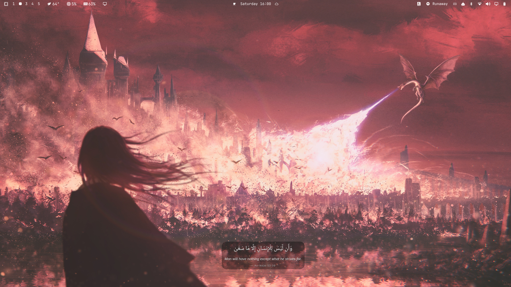
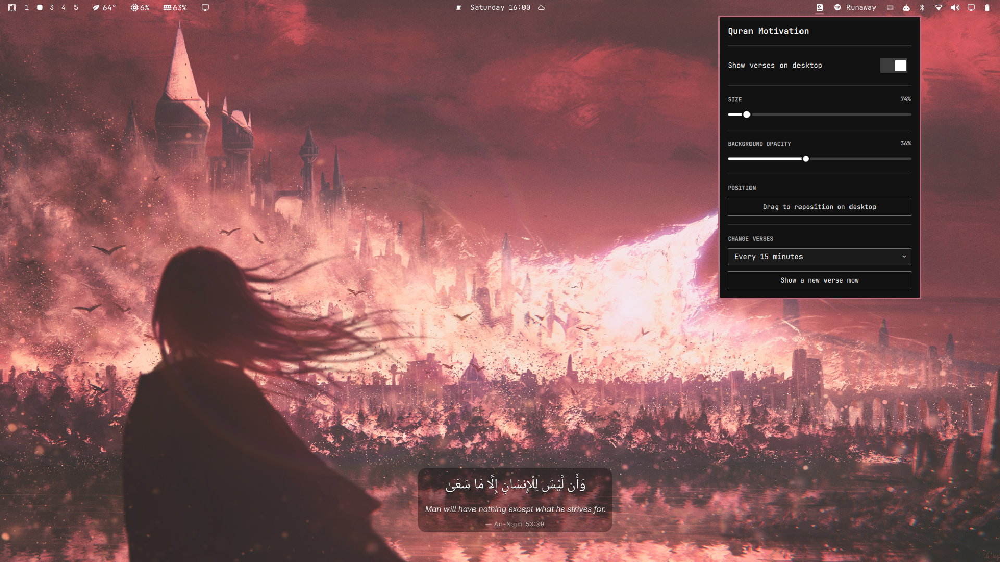

# Quran Motivation

An [Omarchy](https://omarchy.org/) shell plugin that overlays a random
motivational Quran ayah — Arabic text, translation, and reference — on your
desktop background, and gives you a bar icon to control it.

## Screenshots

| Overlay on the desktop | Control panel |
|---|---|
|  |  |

## Features

- **Desktop overlay**: a random ayah sits just above your wallpaper (below
  the bar, panels, and windows), fading in with a soft backdrop for
  legibility on any background.
- **Bar icon control panel**: show/hide the overlay, resize it, adjust the
  background-card opacity (down to fully transparent), and set how often the
  verse rotates (every 15 minutes up to once a day).
- **Drag-and-drop positioning**: click "Drag to reposition on desktop" and
  place the ayah anywhere on screen — click elsewhere to confirm.
- **32 curated ayat** covering hardship, patience, trust in God, hope, and
  gratitude, bundled in a plain `ayahs.json` you can freely edit or extend.
- Fully offline — no network calls, no telemetry. All state lives in one
  local file: `~/.local/state/omarchy/quran-motivation-settings.json`.

## Installation

```bash
omarchy plugin add https://github.com/r4y-br/omarchy-quran-motivation.git --enable
```

This clones the plugin into `~/.config/omarchy/plugins/io.github.r4y-br.quran-motivation/`,
enables it, and adds its bar icon.

If you'd rather place the bar icon yourself:

```bash
omarchy plugin add https://github.com/r4y-br/omarchy-quran-motivation.git
omarchy bar put io.github.r4y-br.quran-motivation --section right
```

### Recommended font

Ayahs render in **Noto Naskh Arabic** for correct Arabic script shaping. On
Arch/Omarchy this is normally already installed via the `noto-fonts` group;
if it's missing, the overlay still works but falls back to your default
font, which may not shape Arabic script as cleanly:

```bash
omarchy pkg add noto-fonts
```

## Usage

Click the book icon in the bar to open the control panel:

- **Show verses on desktop** — toggle the overlay on/off.
- **Size** — scale the ayah text up or down.
- **Background opacity** — dial the backdrop card from fully opaque to
  fully transparent (0%).
- **Drag to reposition on desktop** — closes the panel and lets you drag the
  ayah to any spot on screen; click anywhere else to finish.
- **Change verses** — pick how often a new ayah is shown automatically.
- **Show a new verse now** — cycle to a new random ayah immediately.

You can also drive it over Omarchy's shell IPC:

```bash
omarchy-shell io.github.r4y-br.quran-motivation next   # show a new random ayah
omarchy-shell io.github.r4y-br.quran-motivation edit   # toggle drag-to-reposition mode
omarchy-shell io.github.r4y-br.quran-motivation.panel toggle   # open/close the control panel
```

## Removal

```bash
omarchy plugin disable io.github.r4y-br.quran-motivation
# or, to remove it entirely:
omarchy plugin remove io.github.r4y-br.quran-motivation
```

Removing the plugin does not delete its settings file; delete it yourself if
you want a clean slate:

```bash
rm ~/.local/state/omarchy/quran-motivation-settings.json
```

## A note on the verses

The Arabic text and translations in `ayahs.json` were transcribed and
paraphrased for a concise, motivational reading (in the style of Sahih
International). Translations can vary between scholars, so please verify
important wording against a trusted mushaf or [quran.com](https://quran.com)
rather than relying on this file alone. Corrections and additions via PR are
very welcome.

## License

MIT — see [LICENSE](LICENSE). No bundled third-party code; runtime
dependencies (Omarchy's Quickshell APIs, the optional Noto Naskh Arabic
font) are documented there.
